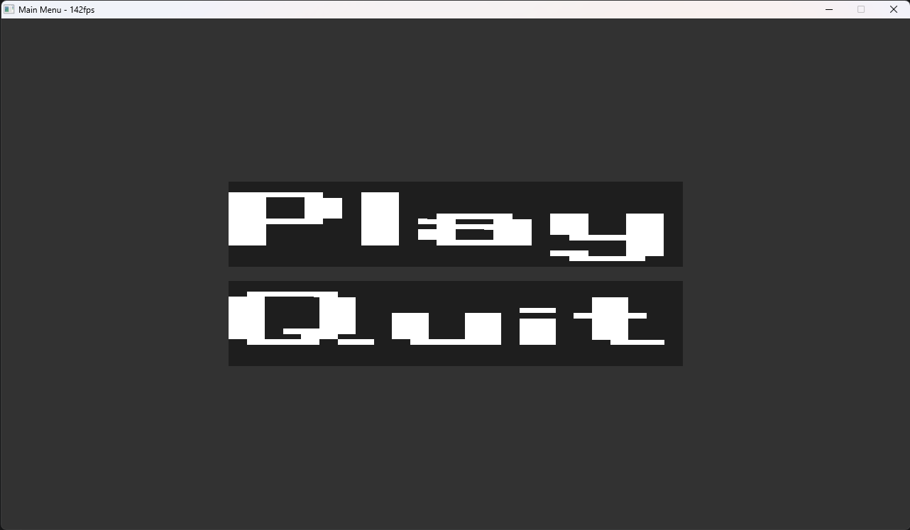
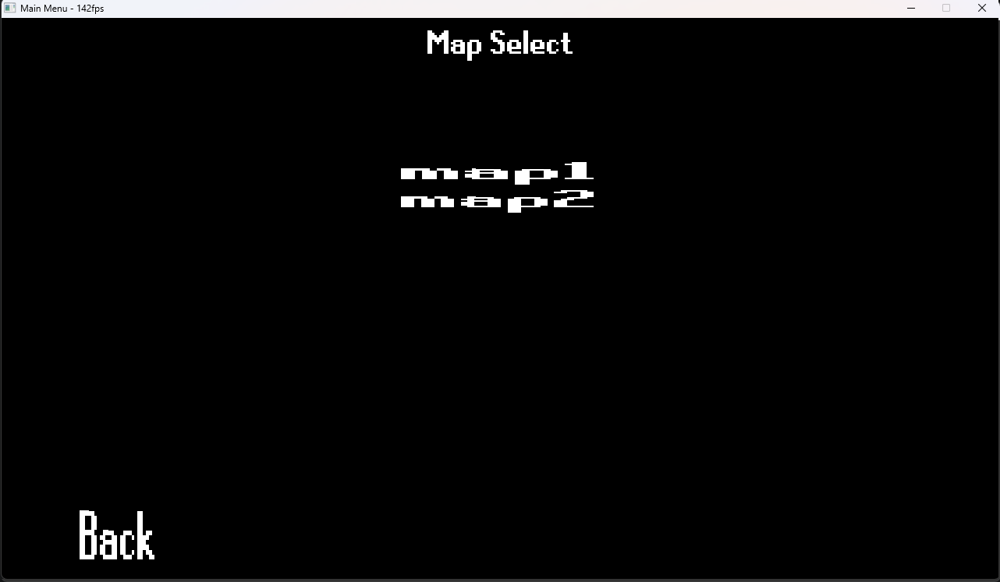
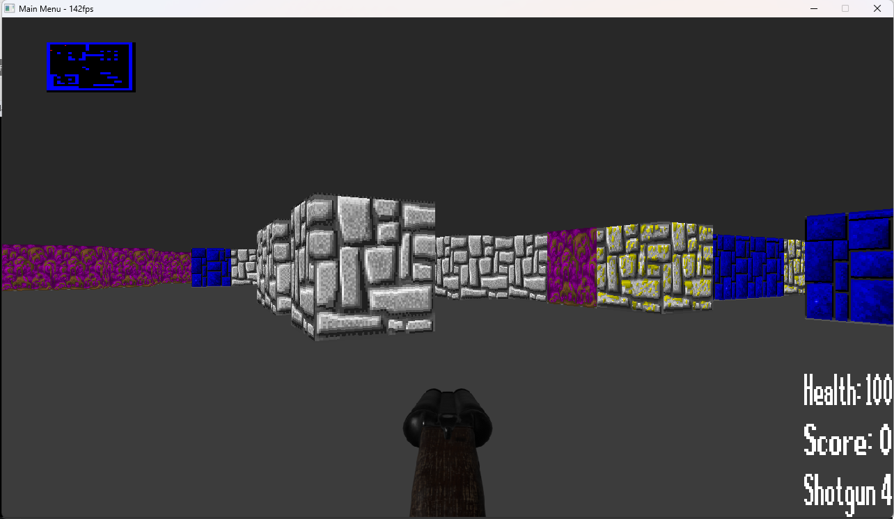
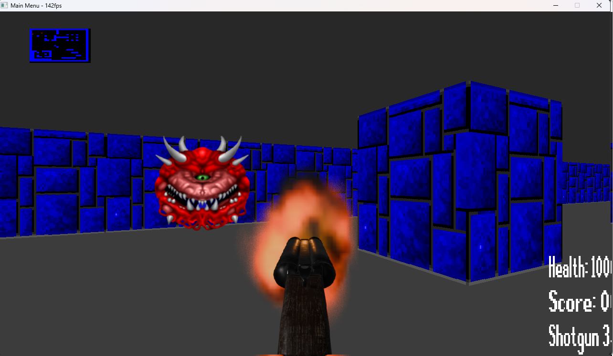

# Description

This game was made using the CastEngine. Right now there is no end goal or victory, however this will be made in the future

User made maps can be stored in the res/maps folder, however there is currently no specification as to how the file should be formatted
This is because the map file format hasn't fully been made, still lots more to add and relatively simple to infer from the existing map files

# Build Instructions

## Windows

Simply run the following commands

```
git clone --recurse-submodules https://github.com/alonsopuente1/TheCaster.git
cd TheCaster
make -j
```

If you have already cloned the repo, you can run this in the repo

```
git submodule update --init --recursive
```

The resulting executable will be stored in the root directory of the repo

## Linux

Have the following packages installed

```
SDL2
SDL2_ttf
SDL2_mixer
SDL2_image
```

Then run the following

```
git clone https://github.com/alonsopuente1/TheCaster.git
cd TheCaster
make -j
```

The resulting executable will be stored in the root directory of the repo

# Screenshots





